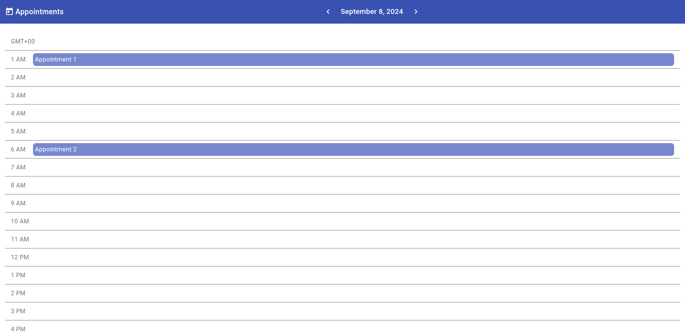
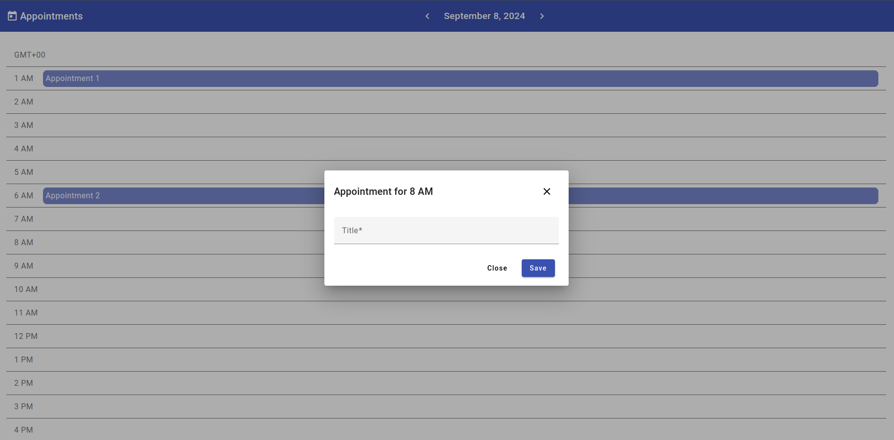

# Appointment Scheduler App

Appointment Scheduler App is a simple Angular-based application that allows users to schedule, manage, and view appointments. The app is built using Angular (v16) and Angular Material, providing a user-friendly interface.

### Features

- Schedule Appointments
- View Appointments
- User friendly UI**
- Dialog for Creating Appointments

## Screenshots

